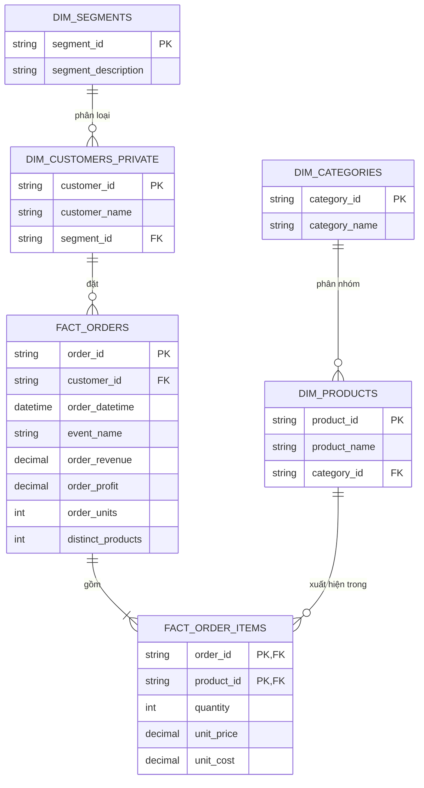

# DV-106 Football E-commerce Analytics

> **Đề tài:** Phân tích hiệu quả kinh doanh và hành vi khách hàng của cửa hàng bóng đá DV-106  

## Mục lục

1. [Tổng quan dự án](#1-tổng-quan-dự-án)
2. [Vấn đề doanh nghiệp](#2-vấn-đề-doanh-nghiệp)
3. [Kiến trúc dữ liệu và ERD](#3-kiến-trúc-dữ-liệu-và-erd)
4. [Khám phá dữ liệu bằng SQL Server](#4-khám-phá-dữ-liệu-bằng-sql-server)
5. [Câu hỏi phân tích](#5-câu-hỏi-phân-tích)
6. [Kết quả phân tích nổi bật](#6-kết-quả-phân-tích-nổi-bật)
7. [Hệ thống dashboard phân tích](#7-hệ-thống-dashboard-phân-tích)
8. [Đề xuất kinh doanh](#8-đề-xuất-kinh-doanh)

## 1. Tổng quan dự án

DV-106 là mô hình cửa hàng thương mại điện tử chuyên kinh doanh áo đấu, giày và phụ kiện bóng đá. Danh mục gồm áo câu lạc bộ, áo đội tuyển quốc gia, áo training, giày bóng đá, bóng, găng tay thủ môn, lót giày–tất, túi thể thao và sản phẩm trẻ em. Cửa hàng phục vụ năm phân khúc, từ học sinh–sinh viên nhạy cảm về giá đến người hâm mộ có thu nhập khá và nhu cầu sưu tầm áo authentic.

Bộ dữ liệu ghi nhận hoạt động từ ngày 01/01/2022 đến 31/12/2024:

| Chỉ số | Giá trị |
|---|---:|
| Dòng sản phẩm trong đơn | 1.471.517 |
| Đơn hàng | 365.911 |
| Khách hàng | 130.166 |
| Sản phẩm / nhóm hàng | 50 / 10 |
| Số lượng sản phẩm bán ra | 1.592.159 |
| Doanh thu | 314,44 tỷ VNĐ |
| Lợi nhuận | 160,31 tỷ VNĐ |
| AOV | 859 nghìn VNĐ/đơn |
| Biên lợi nhuận | 50,98% |

Mục tiêu của dự án là xây dựng một nguồn dữ liệu sạch, định nghĩa KPI nhất quán và bốn dashboard giúp DV-106 nhận diện nguyên nhân suy giảm, phân bổ nguồn lực đúng phân khúc, tối ưu danh mục và chọn thời điểm triển khai chiến dịch.

## 2. Vấn đề doanh nghiệp

### 2.1 Tăng trưởng đảo chiều trong năm 2024

Sau khi doanh thu tăng 22,5% từ 101,58 tỷ đồng năm 2022 lên 124,42 tỷ đồng năm 2023, doanh thu năm 2024 giảm còn 88,43 tỷ đồng, tương đương **giảm 28,9% YoY**. Lợi nhuận cùng kỳ giảm từ 63,55 xuống 45,11 tỷ đồng, tương đương **giảm 29,0%**.

Sự suy giảm không chỉ đến từ số đơn:

| KPI | 2023 | 2024 | Thay đổi |
|---|---:|---:|---:|
| Doanh thu | 124,42 tỷ | 88,43 tỷ | -28,9% |
| Lợi nhuận | 63,55 tỷ | 45,11 tỷ | -29,0% |
| Đơn hàng | 144.169 | 115.320 | -20,0% |
| Khách hàng hoạt động | 61.615 | 53.657 | -12,9% |
| AOV | 863 nghìn | 767 nghìn | -11,1% |

Như vậy, DV-106 đồng thời gặp ba áp lực: ít khách hoạt động hơn, ít đơn hơn và giá trị mỗi đơn thấp hơn.

### 2.2 Doanh thu tập trung nhưng chất lượng lợi nhuận không đồng đều

Phân khúc B2 – fan bóng đá thu nhập khá, sưu tầm áo authentic – tạo 117,14 tỷ đồng, chiếm **37,25% doanh thu**, với AOV cao nhất 1,186 triệu đồng. Tuy nhiên margin của nhóm chỉ đạt 48,1%, thấp hơn mức chung 51,0%. Doanh nghiệp phụ thuộc đáng kể vào một phân khúc lớn nhưng chưa tối ưu được lợi nhuận từ phân khúc này.

Ở cấp danh mục, giày bóng đá tạo 59,94 tỷ đồng doanh thu nhưng margin chỉ **31,4%**. Trong khi đó, áo câu lạc bộ tạo 60,72 tỷ đồng với margin 62,0%, còn áo đội tuyển có margin 67,7%. Điều này cho thấy doanh thu cao không đồng nghĩa với hiệu quả lợi nhuận cao; cơ cấu bán hàng cần được quản trị theo cả doanh thu và margin.

### 2.3 Giá trị vòng đời khách hàng còn dư địa cải thiện

Trong 130.166 khách hàng, có 59.704 khách chỉ mua một lần, tương đương **45,87%**; 70.462 khách quay lại ít nhất một lần, tương đương 54,13%. Số đơn trung bình đạt 2,81 đơn/khách. Quy mô khách hàng lớn nhưng gần một nửa chưa được chuyển đổi thành khách hàng lặp lại.

### 2.4 Hiệu quả chiến dịch và mùa vụ chênh lệch lớn

Ngày thường tạo trung bình 276,05 triệu đồng/ngày. Giai đoạn khai mạc mùa giải mới đạt 445,39 triệu đồng/ngày, cao hơn **61,3%**, trong khi Tết chỉ đạt 160,39 triệu đồng/ngày và Asian Cup đạt 173,98 triệu đồng/ngày. Doanh nghiệp cần phân biệt sự kiện tạo cầu thật với sự kiện chỉ có tổng doanh thu lớn do kéo dài nhiều ngày.

## 3. Kiến trúc dữ liệu và ERD

Dữ liệu export từ Tableau đã được phục hồi thành mô hình giao dịch chuẩn, tách bảng đơn hàng, chi tiết đơn và các dimension. Các calculated field trùng lặp của Tableau không được đưa vào tầng clean.



Quan hệ và quy tắc phục hồi chi tiết nằm trong [docs/reconstruction.md](docs/reconstruction.md). Tên khách hàng thuộc dữ liệu riêng tư và không được đưa lên GitHub.

## 4. Khám phá dữ liệu bằng SQL Server

Sau khi chuẩn hóa dữ liệu thành mô hình fact–dimension, SQL Server được sử dụng để kiểm tra KPI, khám phá xu hướng và tạo bằng chứng định lượng trước khi trực quan hóa trên Tableau. Toàn bộ truy vấn có thể xem tại [Ecommer_Football.sql](Ecommer_Football.sql).

### 4.1 Mục tiêu EDA

- Đối soát số đơn, doanh thu, lợi nhuận, sản lượng, AOV và profit margin với dashboard.
- Xác định xu hướng tăng trưởng theo năm và tính Revenue YoY.
- So sánh hiệu quả năm phân khúc khách hàng.
- Phân biệt khách mua một lần với khách quay lại và chấm điểm RFM.
- Đánh giá nhóm hàng/SKU theo doanh thu, lợi nhuận, sản lượng và margin.
- Xác định khung giờ có doanh thu và nhu cầu trung bình cao.

### 4.2 Các nhóm truy vấn

| Nhóm EDA | Chỉ số/kỹ thuật | Mục đích kinh doanh |
|---|---|---|
| Tổng quan | `COUNT DISTINCT`, `SUM`, AOV, margin | Xây baseline và kiểm tra KPI toàn kỳ |
| Tăng trưởng | `YEAR`, CTE, `LAG`, YoY | Phát hiện điểm đảo chiều năm 2024 |
| Khách hàng | JOIN dimension, CTE, window function | Đánh giá phân khúc, repeat rate và RFM |
| Sản phẩm | JOIN fact–dimension, ratio of sums | So sánh doanh thu, lợi nhuận và margin |
| Mùa vụ | `DATEPART`, CTE, doanh thu trung bình/ngày–giờ | Xác định thời điểm nhu cầu cao |

### 4.3 Nguyên tắc tính toán

Hai mức chi tiết được sử dụng riêng để tránh double-count:

- `fact_orders`: một dòng mỗi đơn; dùng cho doanh thu tổng, AOV, khách hàng, RFM, YoY và mùa vụ.
- `fact_order_items`: một dòng mỗi sản phẩm trong đơn; dùng cho SKU/category, quantity, unit price và unit cost.
- Không cộng `order_revenue` sau khi join `fact_orders` với `fact_order_items`, vì doanh thu của một đơn sẽ lặp lại trên từng sản phẩm.
- Doanh thu sản phẩm được tái tạo bằng `quantity × unit_price`; lợi nhuận bằng `quantity × (unit_price − unit_cost)`.
- Tiền tệ sử dụng `DECIMAL(18,2)` thay cho `FLOAT` để hạn chế sai số biểu diễn.
- AOV và margin được tính theo ratio of sums, không lấy trung bình tỷ lệ cấp dòng.

### 4.4 Truy vấn KPI tổng quan

```sql
SELECT
    COUNT(DISTINCT order_id) AS Total_Orders,
    SUM(CAST(order_revenue AS DECIMAL(18,2))) AS Total_Revenue,
    SUM(CAST(order_profit AS DECIMAL(18,2))) AS Total_Profit,
    SUM(CAST(order_units AS INT)) AS Total_Units,
    ROUND(
        SUM(CAST(order_revenue AS DECIMAL(18,2)))
        / COUNT(DISTINCT order_id),
        2
    ) AS AOV,
    ROUND(
        SUM(CAST(order_profit AS DECIMAL(18,2))) * 100.0
        / NULLIF(SUM(CAST(order_revenue AS DECIMAL(18,2))), 0),
        2
    ) AS Profit_Margin_Percent
FROM fact_orders;
```

Kết quả đối soát:

| Total Orders | Revenue | Profit | Units | AOV | Margin |
|---:|---:|---:|---:|---:|---:|
| 365.911 | 314,44 tỷ | 160,31 tỷ | 1.592.159 | 859.327 | 50,98% |

### 4.5 Phân tích tăng trưởng YoY

CTE thứ nhất tổng hợp doanh thu theo năm; CTE thứ hai dùng `LAG()` để lấy doanh thu của năm liền trước.

```sql
WITH YearlyRevenue AS (
    SELECT
        YEAR(order_datetime) AS order_year,
        SUM(CAST(order_revenue AS DECIMAL(18,2))) AS revenue
    FROM fact_orders
    GROUP BY YEAR(order_datetime)
),
RevenueComparison AS (
    SELECT
        order_year,
        revenue,
        LAG(revenue) OVER (ORDER BY order_year) AS previous_year_revenue
    FROM YearlyRevenue
)
SELECT
    order_year,
    revenue,
    previous_year_revenue,
    revenue - previous_year_revenue AS revenue_change,
    ROUND(
        100.0 * (revenue - previous_year_revenue)
        / NULLIF(previous_year_revenue, 0),
        2
    ) AS yoy_growth_pct
FROM RevenueComparison
ORDER BY order_year;
```

| Năm | Doanh thu | YoY |
|---:|---:|---:|
| 2022 | 101,58 tỷ | — |
| 2023 | 124,42 tỷ | +22,49% |
| 2024 | 88,43 tỷ | -28,92% |

### 4.6 Phân tích khách hàng

Phần customer EDA gồm ba lớp:

1. So sánh khách hàng, đơn hàng, doanh thu, lợi nhuận và AOV giữa các phân khúc.
2. Đếm số đơn theo khách để tách one-time và repeat customer.
3. Tính Recency–Frequency–Monetary và chia mỗi chỉ số thành năm nhóm bằng `NTILE(5)`.

```sql
WITH CustomerRFM AS (
    SELECT
        customer_id,
        DATEDIFF(DAY, MAX(order_datetime), '2025-01-01') AS recency,
        COUNT(order_id) AS frequency,
        SUM(CAST(order_revenue AS DECIMAL(18,2))) AS monetary
    FROM fact_orders
    GROUP BY customer_id
)
SELECT
    customer_id,
    recency,
    frequency,
    monetary,
    6 - NTILE(5) OVER (ORDER BY recency) AS r_score,
    NTILE(5) OVER (ORDER BY frequency) AS f_score,
    NTILE(5) OVER (ORDER BY monetary) AS m_score
FROM CustomerRFM;
```

Kết quả cho thấy 70.462 khách hàng quay lại ít nhất một lần, chiếm 54,13%; 59.704 khách chỉ mua một lần, chiếm 45,87%. B2 dẫn đầu về doanh thu và AOV, trong khi A1 có margin tốt hơn nhưng giá trị đơn thấp hơn.

### 4.7 Phân tích sản phẩm và nhóm hàng

Doanh thu và lợi nhuận category được tính lại từ dòng sản phẩm thay vì dùng doanh thu cấp đơn:

```sql
WITH CategorySummary AS (
    SELECT
        C.category_id,
        C.category_name,
        COUNT(DISTINCT I.order_id) AS Total_Orders,
        SUM(I.quantity * I.unit_price) AS Total_Revenue,
        SUM(I.quantity * (I.unit_price - I.unit_cost)) AS Total_Profit,
        SUM(I.quantity) AS Total_Units
    FROM fact_order_items AS I
    INNER JOIN dim_products AS P
        ON I.product_id = P.product_id
    INNER JOIN dim_categories AS C
        ON P.category_id = C.category_id
    GROUP BY C.category_id, C.category_name
)
SELECT
    *,
    ROUND(
        Total_Profit * 100.0 / NULLIF(Total_Revenue, 0),
        2
    ) AS Profit_Margin_Percent
FROM CategorySummary
ORDER BY Total_Revenue DESC;
```

EDA chỉ ra sự khác biệt lớn về chất lượng doanh thu: áo câu lạc bộ đạt 60,72 tỷ đồng với margin 62,03%; giày bóng đá đạt 59,94 tỷ đồng nhưng margin chỉ 31,42%; lót giày–tất có margin 68,96% và phù hợp làm sản phẩm mua kèm.

### 4.8 Phân tích mùa vụ theo giờ

Doanh thu được tổng hợp theo ngày–giờ trước, sau đó mới lấy trung bình giữa các ngày. Cách này giúp trả lời “một giờ điển hình tạo bao nhiêu doanh thu” thay vì lấy trung bình từng đơn hàng.

```sql
WITH AnalysisHour AS (
    SELECT
        CAST(order_datetime AS DATE) AS order_date,
        DATEPART(HOUR, order_datetime) AS order_hour,
        SUM(CAST(order_revenue AS DECIMAL(18,2))) AS daily_hour_revenue,
        SUM(CAST(order_units AS INT)) AS daily_hour_units
    FROM fact_orders
    GROUP BY
        CAST(order_datetime AS DATE),
        DATEPART(HOUR, order_datetime)
)
SELECT
    order_hour,
    ROUND(AVG(daily_hour_revenue) / 1000000.0, 2)
        AS Avg_Revenue_Million_VND,
    ROUND(AVG(CAST(daily_hour_units AS DECIMAL(18,2))), 2)
        AS Avg_Units
FROM AnalysisHour
WHERE order_hour BETWEEN 8 AND 23
GROUP BY order_hour
ORDER BY order_hour;
```

Kết quả hỗ trợ insight vận hành: nhu cầu tăng về cuối ngày và ca 20:00–23:59 có số đơn cao nhất, phù hợp để ưu tiên quảng cáo, tồn kho sẵn sàng và nhân sự xử lý đơn.

## 5. Câu hỏi phân tích

1. Doanh thu, lợi nhuận, số đơn, số khách và AOV biến động thế nào theo năm, quý và tháng?
2. Yếu tố nào đóng góp lớn nhất vào mức giảm doanh thu năm 2024: khách hàng, tần suất mua hay giá trị giỏ hàng?
3. Phân khúc nào tạo doanh thu, AOV và biên lợi nhuận tốt nhất? Phân khúc nào đang phụ thuộc nhiều nhưng hiệu quả thấp?
4. Tỷ lệ khách mua một lần và khách quay lại là bao nhiêu? Cohort nào có khả năng duy trì tốt nhất?
5. Nhóm hàng và SKU nào dẫn đầu về doanh thu, lợi nhuận, sản lượng và margin?
6. Sản phẩm doanh thu cao nào có margin thấp và cần xem lại giá bán hoặc giá vốn?
7. Những sản phẩm/nhóm hàng nào thường được mua cùng nhau và có thể tạo combo?
8. Sự kiện nào tạo uplift doanh thu/ngày và AOV so với ngày thường?
9. Ngày trong tuần và khung giờ nào có nhu cầu cao nhất để tối ưu quảng cáo, nhân sự và tồn kho?
10. DV-106 nên ưu tiên phân khúc, danh mục và chiến dịch nào để phục hồi tăng trưởng?

## 6. Kết quả phân tích nổi bật

- **2024 là điểm suy giảm rõ rệt:** doanh thu giảm 28,9%, lợi nhuận giảm 29,0%, số đơn giảm 20,0% và AOV giảm 11,1% so với 2023.
- **B2 là phân khúc giá trị cao nhất:** đóng góp 117,14 tỷ đồng, tương đương 37,25% tổng doanh thu; AOV đạt 1,186 triệu đồng, nhưng margin 48,1% còn dưới trung bình.
- **A1 có hiệu quả biên lợi nhuận tốt:** phân khúc học sinh tạo 50,12 tỷ đồng với margin 57,1%, cao nhất trong năm phân khúc, dù AOV chỉ 663 nghìn đồng.
- **Giày tạo doanh thu lớn nhưng margin thấp:** doanh thu 59,94 tỷ đồng gần ngang áo câu lạc bộ, nhưng margin chỉ 31,4% so với 62,0% của áo câu lạc bộ.
- **Lót giày và tất là nhóm add-on tiềm năng:** xuất hiện trong 229.572 đơn, tạo margin 69,0% nhưng chỉ đóng góp 15,89 tỷ đồng doanh thu. Đây là nhóm phù hợp để cross-sell thay vì giảm giá sâu.
- **Khai mạc mùa giải mới là sự kiện mạnh nhất:** doanh thu trung bình 445,39 triệu đồng/ngày, cao hơn ngày thường 61,3%; AOV đạt 1,067 triệu đồng, cao hơn ngày thường khoảng 27,0%.
- **Cuối tuần và buổi tối có nhu cầu cao:** thứ Bảy đạt 316,23 triệu đồng/ngày, Chủ Nhật đạt 310,74 triệu; ca khuya 20:00–23:59 có 95.910 đơn, cao nhất trong các khung giờ.
- **Dư địa giữ chân còn lớn:** 45,87% khách hàng chỉ mua một lần. Việc cải thiện repeat rate có thể giúp phục hồi tăng trưởng mà không phụ thuộc hoàn toàn vào chi phí tìm khách mới.
- **Giỏ hàng có khả năng bundle tốt:** bình quân mỗi đơn chứa 4,02 SKU khác nhau và 4,35 sản phẩm; 129.293 đơn có từ năm SKU trở lên.

## 7. Hệ thống dashboard phân tích

### Dashboard 1 — Overview


**Tác dụng:** cung cấp health check toàn doanh nghiệp thông qua khách hàng, doanh thu, lợi nhuận, sản lượng, phân khúc, cơ cấu đơn và xu hướng theo thời gian.

**Insight chính:** cửa hàng đạt 314,44 tỷ đồng doanh thu và 160,31 tỷ đồng lợi nhuận trong ba năm. Tuy nhiên xu hướng cho thấy năm 2024 suy giảm sau đỉnh 2023. Phân phối giỏ hàng lệch phải cho thấy phần lớn đơn tập trung ở quy mô nhỏ–trung bình, trong khi nhóm đơn nhiều sản phẩm tạo cơ hội bundle.

### Dashboard 2 — Customer


**Tác dụng:** phân tích cơ cấu phân khúc, RFM, khách mới–khách quay lại, retention và mối quan hệ giữa phân khúc với nhóm hàng.

**Insight chính:** B2 tạo tỷ trọng doanh thu lớn nhất và AOV cao nhất; A1 có margin tốt nhưng giá trị đơn thấp hơn. Khoảng 45,87% khách chỉ mua một lần, vì vậy CRM và lifecycle marketing là đòn bẩy quan trọng. Retention/RFM giúp xác định nhóm cần giữ chân, tái kích hoạt và nhóm VIP cần chăm sóc riêng.

### Dashboard 3 — Goods


**Tác dụng:** đánh giá hiệu quả danh mục và SKU theo doanh thu, lợi nhuận, margin, quy mô, tăng trưởng, ABC/Pareto và hành vi mua kèm.

**Insight chính:** áo câu lạc bộ và giày đều tạo khoảng 60 tỷ đồng doanh thu, nhưng margin chênh lệch gần gấp đôi. Lót giày–tất có margin cao và độ phủ đơn hàng lớn, phù hợp làm add-on. Market basket và Pareto giúp chọn sản phẩm chủ lực, sản phẩm duy trì và combo có khả năng tăng basket size.

### Dashboard 4 — Seasonality


**Tác dụng:** nhận diện mùa cao điểm theo tháng, sự kiện bóng đá, ngày trong tuần, ngày trong tháng và khung giờ; đồng thời xếp hạng sản phẩm theo tiêu chí lựa chọn.

**Insight chính:** khai mạc mùa giải mới tạo uplift doanh thu/ngày mạnh nhất. Thứ Bảy, Chủ Nhật và khung 20:00–23:59 là các thời điểm nhu cầu cao. Ngược lại, Tết và Asian Cup có doanh thu/ngày thấp hơn ngày thường, nên không nên mặc định mọi sự kiện đều đáng đầu tư ngân sách lớn.

## 8. Đề xuất kinh doanh

### 8.1 Phục hồi tăng trưởng bằng chiến lược khách hàng hai tầng

- Với B2, triển khai membership/VIP, pre-order áo mới, phiên bản giới hạn và quyền mua sớm; hạn chế khuyến mãi đại trà để bảo vệ margin.
- Với A1/A2, xây combo áo–quần–tất theo mức giá dễ tiếp cận nhằm tăng AOV thay vì giảm trực tiếp giá áo.
- Thiết lập chuỗi CRM sau đơn đầu tiên ở ngày 7, 30 và 60; ưu tiên chuyển đổi 59.704 khách mua một lần thành khách quay lại.

### 8.2 Quản trị danh mục theo doanh thu và margin

- Giày bóng đá cần được rà soát giá vốn, mức chiết khấu và hiệu quả từng SKU vì margin danh mục chỉ 31,4%.
- Duy trì áo câu lạc bộ và áo đội tuyển làm profit drivers nhờ margin lần lượt 62,0% và 67,7%.
- Đưa lót giày, tất, băng bảo vệ vào gợi ý mua kèm tại trang sản phẩm và checkout; đây là nhóm margin cao, giá thấp và dễ bổ sung vào đơn.
- Áp dụng ABC theo doanh thu tích lũy kết hợp margin; không giữ SKU chỉ vì doanh thu cao nếu vòng quay chậm hoặc lợi nhuận thấp.

### 8.3 Phân bổ ngân sách theo uplift thực tế

- Ưu tiên launch áo đấu và khai mạc mùa giải, bắt đầu truyền thông trước sự kiện 2–3 tuần và đảm bảo tồn kho các SKU liên quan.
- Với Champions League và SEA Games, dùng chiến dịch ngắn, tập trung sản phẩm đúng đội tuyển/CLB.
- Giảm hoặc thử nghiệm ngân sách nhỏ cho Tết và Asian Cup cho đến khi chứng minh được uplift sau khi kiểm soát số ngày và mùa vụ.

### 8.4 Tối ưu lịch vận hành và quảng cáo

- Tăng ngân sách remarketing từ 16:00 đến 23:59, đặc biệt tối thứ Sáu–Chủ Nhật.
- Bố trí nhân sự chăm sóc khách hàng và xử lý đơn cao hơn vào cuối tuần và ca khuya.
- Đảm bảo tồn kho sản phẩm chủ lực trước thứ Bảy; sử dụng ca sáng/thứ Hai cho chiến dịch kích cầu có kiểm soát.

### 8.5 Thiết lập hệ thống đo lường

- Theo dõi hàng tháng: revenue growth, profit growth, orders, active customers, AOV, margin, repeat rate và event uplift.
- Định nghĩa AOV là `SUM(revenue) / COUNTD(order_id)` và margin là `SUM(profit) / SUM(revenue)` để tránh sai lệch từ dữ liệu line-item.
- Bổ sung dữ liệu discount, marketing cost, inventory, returns và channel trong giai đoạn tiếp theo để đo ROAS, tồn kho và lợi nhuận thực sau khuyến mãi.

## Data pipeline và cách chạy

```bash
python src/reconstruct_raw.py --input Ecommer_Data.csv --output data/clean
python src/data_pipeline.py --input Ecommer_Data.csv --output data/processed
python -m unittest discover -s tests -v
```

```text
Ecommer_Data.csv (Tableau export)
        ↓ reconstruct_raw.py
Fact orders + fact order items + dimensions
        ↓ SQL Server / Ecommer_Football.sql
EDA + KPI validation + customer/product/seasonality analysis
        ↓ data_pipeline.py
Analytical marts
        ↓ Tableau
Overview | Customer | Goods | Seasonality
```

## Cấu trúc repository

```text
.
├── data/
│   ├── raw/                     # dữ liệu nguồn, không commit
│   ├── clean/                   # fact/dimension, không commit
│   └── processed/               # data marts, không commit mặc định
├── docs/
│   ├── analysis_plan.md
│   ├── data_dictionary.md
│   └── reconstruction.md
├── reports/figures/             # ảnh dashboard dùng trong README
├── scripts/                     # profiling và insight validation
├── src/
│   ├── reconstruct_raw.py
│   └── data_pipeline.py
├── tests/test_metrics.py
├── Ecommer_Football.sql          # toàn bộ EDA bằng SQL Server
└── README.md
```

## Data privacy và giới hạn

- Raw data và bảng khách hàng chứa thông tin cá nhân nên không được commit.
- Workbook `.twbx` hiện tại lớn hơn giới hạn file thông thường của GitHub và có thể đóng gói dữ liệu; chỉ chia sẻ sau khi loại PII hoặc dùng Tableau Public với nguồn đã ẩn danh.
- Dữ liệu chưa có discount, chi phí marketing, tồn kho, hoàn trả và kênh bán; các đề xuất liên quan ROAS hoặc inventory cần bổ sung nguồn trước khi triển khai.
